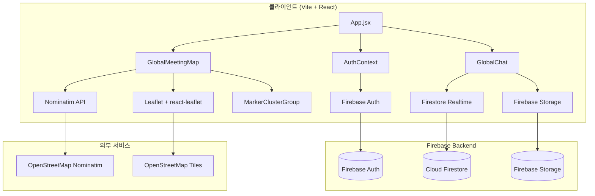

# 🔧 TRD (Technical Requirements Document) — GlobalMeet

## 1. 시스템 아키텍처



---

## 2. 기술 스택 상세

### 2.1 프론트엔드

| 패키지 | 버전 | 용도 |
|--------|------|------|
| `vite` | ^7.x | 빌드 도구 |
| `react` | ^19.x | UI 프레임워크 |
| `react-dom` | ^19.x | DOM 렌더러 |
| `react-router-dom` | ^7.x | SPA 라우팅 |
| `tailwindcss` | ^3.4 | CSS 유틸리티 |
| `leaflet` | ^1.9.4 | 지도 코어 |
| `react-leaflet` | ^5.0.0 | React-Leaflet 바인딩 |
| `react-leaflet-cluster` | ^4.1.3 | MarkerCluster 래퍼 |
| `leaflet.markercluster` | ^1.5.3 | Leaflet 클러스터 플러그인 |
| `firebase` | ^12.x | Firebase JS SDK |
| `lucide-react` | ^0.56x | 아이콘 |
| `date-fns` | ^4.x | 날짜 포맷 |
| `i18next` | ^26.x | 다국어 |
| `react-i18next` | ^17.x | React i18n 바인딩 |

### 2.2 Firebase 서비스

| 서비스 | 용도 |
|--------|------|
| **Firebase Authentication** | Google 소셜 로그인 |
| **Cloud Firestore** | 핀 데이터, 채팅 데이터, 유저 프로필 |
| **Firebase Storage** | 채팅 이미지 저장 |
| **Firebase Hosting** _(선택)_ | 정적 사이트 배포 |

---

## 3. 프로젝트 디렉토리 구조

```
global-meet/
├── index.html
├── package.json
├── vite.config.js
├── tailwind.config.js
├── postcss.config.js
├── firebase.json
├── firestore.rules
├── storage.rules
├── public/
│   └── favicon.ico
└── src/
    ├── main.jsx                     # React 엔트리포인트
    ├── App.jsx                      # 라우팅 + AuthProvider
    ├── index.css                    # Tailwind + 글로벌 스타일 + 클러스터 CSS
    │
    ├── lib/
    │   ├── firebase.js              # Firebase 초기화 (app, auth, db, storage)
    │   └── imageUtils.js            # WebP 압축 유틸리티
    │
    ├── context/
    │   └── AuthContext.jsx           # 인증 전역 상태
    │
    ├── components/
    │   ├── Login.jsx                 # Google 로그인 페이지
    │   ├── GlobalMeetingMap.jsx      # 지도 메인 컴포넌트
    │   ├── GlobalChat.jsx            # 채팅 메인 컴포넌트
    │   ├── CreateRoomModal.jsx       # 대화방 생성 모달
    │   └── ImageLightbox.jsx         # 이미지 전체화면 뷰어
    │
    └── i18n/
        ├── index.js                  # i18next 초기화
        └── locales/
            ├── ko.json               # 한국어
            ├── en.json               # 영어
            └── zh.json               # 중국어
```

---

## 4. Firebase 설정

### 4.1 firebase.js

```javascript
import { initializeApp } from "firebase/app";
import { getAuth, GoogleAuthProvider } from "firebase/auth";
import { getFirestore } from "firebase/firestore";
import { getStorage } from "firebase/storage";

const firebaseConfig = {
    apiKey: "YOUR_API_KEY",
    authDomain: "YOUR_PROJECT.firebaseapp.com",
    projectId: "YOUR_PROJECT_ID",
    storageBucket: "YOUR_PROJECT.firebasestorage.app",
    messagingSenderId: "YOUR_SENDER_ID",
    appId: "YOUR_APP_ID",
};

const app = initializeApp(firebaseConfig);
export const auth = getAuth(app);
export const googleProvider = new GoogleAuthProvider();
export const db = getFirestore(app);
export const storage = getStorage(app);
```

### 4.2 Google Auth Provider 설정
1. Firebase Console → Authentication → 로그인 방법 → Google 사용 설정
2. 승인된 도메인에 배포 도메인 추가
3. Google Cloud Console → OAuth 동의 화면 구성

---

## 5. 데이터 모델 (Firestore)

### 5.1 `users/{uid}`

```typescript
interface UserProfile {
    email: string;
    displayName: string;
    photoURL: string;
    preferredLanguage: 'ko' | 'en' | 'zh';
    createdAt: string;        // ISO 8601
    lastSeen: string;         // ISO 8601
    emailSanitized: string;   // email의 . → _ 치환
}
```

### 5.2 `globalPins/{pinId}`

```typescript
interface GlobalPin {
    lat: number;
    lng: number;
    address: string;            // 사용자 입력 주소 또는 좌표 문자열
    resolvedAddress: string;    // Nominatim 반환 주소
    title: string;              // 선택적 핀 제목
    createdBy: string;          // email
    createdByName: string;      // displayName
    createdAt: Timestamp;
}
```

### 5.3 `liveLocations/{uid}`

```typescript
interface LiveLocation {
    uid: string;
    email: string;
    displayName: string;
    lat: number;
    lng: number;
    accuracy: number | null;
    updatedAt: Timestamp;
}
```

### 5.4 `globalChatRooms/{roomId}`

```typescript
interface ChatRoom {
    name: string;
    createdBy: string;          // email (lowercase)
    createdByName: string;
    members: string[];          // emails (lowercase)
    memberNames: Record<string, string>;  // email → name
    createdAt: Timestamp;
}
```

### 5.5 `globalChatRooms/{roomId}/messages/{messageId}`

```typescript
interface ChatMessage {
    text: string;
    imageUrl?: string;
    imagePath?: string;
    imageWidth?: number;
    imageHeight?: number;
    senderEmail: string;
    senderName: string;
    sourceLanguage: string;
    timestamp: Timestamp;
    readBy: string[];           // emails
    translations?: Record<string, string>;  // lang → translated text
}
```

---

## 6. Firestore Security Rules

```rules
rules_version = '2';
service cloud.firestore {
  match /databases/{database}/documents {

    // ── Helpers ──
    function isSignedIn() { return request.auth != null; }
    function myUid()      { return request.auth.uid; }
    function myEmail()    { return request.auth.token.email.lower(); }

    function onlyAffects(fields) {
      return request.resource.data.diff(resource.data).affectedKeys().hasOnly(fields);
    }

    function roomDoc(roomId) {
      return get(/databases/$(database)/documents/globalChatRooms/$(roomId));
    }
    function isRoomMember(roomId) {
      return isSignedIn()
        && exists(/databases/$(database)/documents/globalChatRooms/$(roomId))
        && myEmail() in roomDoc(roomId).data.members;
    }
    function isRoomOwner(roomId) {
      return isSignedIn()
        && exists(/databases/$(database)/documents/globalChatRooms/$(roomId))
        && roomDoc(roomId).data.createdBy == myEmail();
    }

    // ── Users ──
    match /users/{userId} {
      allow read:   if isSignedIn();
      allow create: if isSignedIn() && myUid() == userId;
      allow update: if isSignedIn() && myUid() == userId;
      allow delete: if false;
    }

    // ── Global Pins ──
    match /globalPins/{pinId} {
      allow read:   if isSignedIn();
      allow create: if isSignedIn()
        && request.resource.data.createdBy == request.auth.token.email;
      allow update: if false;
      allow delete: if isSignedIn()
        && resource.data.createdBy == request.auth.token.email;
    }

    // ── Live Locations ──
    match /liveLocations/{userId} {
      allow read:   if isSignedIn();
      allow create: if isSignedIn() && myUid() == userId;
      allow update: if isSignedIn() && myUid() == userId;
      allow delete: if isSignedIn() && myUid() == userId;
    }

    // ── Global Chat Rooms ──
    match /globalChatRooms/{roomId} {
      allow read: if isSignedIn() && myEmail() in resource.data.members;

      allow create: if isSignedIn()
        && request.resource.data.createdBy == myEmail()
        && myEmail() in request.resource.data.members;

      allow update: if isSignedIn() && (
        resource.data.createdBy == myEmail()
        || (
          myEmail() in resource.data.members
          && onlyAffects(['members'])
          && !(myEmail() in request.resource.data.members)
        )
      );

      allow delete: if isSignedIn()
        && resource.data.createdBy == myEmail();

      // ── Messages Subcollection ──
      match /messages/{messageId} {
        allow read:   if isRoomMember(roomId);
        allow create: if isRoomMember(roomId)
          && request.resource.data.senderEmail == request.auth.token.email;
        allow update: if isRoomMember(roomId);
        allow delete: if isSignedIn()
          && (resource.data.senderEmail == request.auth.token.email
              || isRoomOwner(roomId));
      }
    }

    // ── Default deny ──
    match /{document=**} {
      allow read, write: if false;
    }
  }
}
```

---

## 7. Storage Rules

```rules
rules_version = '2';
service firebase.storage {
  match /b/{bucket}/o {
    match /globalChatImages/{roomId}/{userId}/{fileName} {
      allow read: if request.auth != null;
      allow write: if request.auth != null
                   && request.auth.uid == userId
                   && request.resource.size < 10 * 1024 * 1024
                   && request.resource.contentType.matches('image/.*');
      allow delete: if request.auth != null
                    && request.auth.uid == userId;
    }
    match /{allPaths=**} {
      allow read, write: if false;
    }
  }
}
```

---

## 8. 컴포넌트 설계

### 8.1 GlobalMeetingMap — 핵심 컴포넌트

```
GlobalMeetingMap
├── AddressInputForm          # 주소 + 제목 입력 폼
├── SearchToolbar             # 키워드 검색 토글 + 결과 리스트
├── PendingPinCard            # 임시 핀 확인 카드 (오렌지)
├── MapContainer              # Leaflet 지도 컨테이너
│   ├── TileLayer             # OpenStreetMap 타일
│   ├── MarkerClusterGroup    # ★ 클러스터링 래퍼
│   │   └── Marker[]          # 저장된 핀들 (savedPinIcon)
│   ├── Marker (pending)      # 임시 핀 (pendingIcon)
│   ├── Marker (myLocation)   # 내 위치 (myLocationIcon)
│   ├── Marker[] (shared)     # 실시간 공유 위치 (sharedLocationIcon)
│   ├── MapResizeFix          # ResizeObserver 기반 사이즈 보정
│   ├── ClickToPin            # 지도 클릭 이벤트 핸들러
│   └── MapFlyTo              # flyTo 애니메이션 트리거
├── ControlStack              # 지도 우상단 컨트롤
│   ├── SharedUsersList       # 공유 중인 사용자 목록 (접이식)
│   ├── ShareButton           # 위치 공유 시작/중지
│   └── LocateButton          # 내 위치 찾기 (원샷)
├── InfoBar                   # 핀 수, 로그인 상태 안내
├── PinsListModal             # 전체 핀 목록 모달
└── GlobalChat                # 하단 실시간 채팅
```

### 8.2 MarkerClusterGroup 적용 패턴

```jsx
import MarkerClusterGroup from 'react-leaflet-cluster';

// 지도 내부
<MapContainer center={[37.5665, 126.9780]} zoom={6}>
  <TileLayer url="https://{s}.tile.openstreetmap.org/{z}/{x}/{y}.png" />
  
  {/* ★ 클러스터 그룹 — 저장된 핀만 감싸기 */}
  <MarkerClusterGroup
    chunkedLoading
    maxClusterRadius={60}
    spiderfyOnMaxZoom
    showCoverageOnHover={false}
    zoomToBoundsOnClick
  >
    {pins.map(pin => (
      <Marker
        key={pin.id}
        position={[pin.lat, pin.lng]}
        icon={savedPinIcon}
      >
        <Popup>...</Popup>
      </Marker>
    ))}
  </MarkerClusterGroup>

  {/* 임시 핀, 내 위치, 공유 위치는 클러스터 밖에 배치 */}
  {pendingPin && <Marker ... />}
  {myLocation && <Marker ... />}
  {sharedUsers.map(u => <Marker ... />)}
</MapContainer>
```

### 8.3 GlobalChat — 핵심 컴포넌트

```
GlobalChat
├── RoomToolbar
│   ├── RoomDropdown           # 대화방 선택 드롭다운
│   ├── MembersButton          # 참여자 패널 토글
│   ├── AutoVoiceToggle        # 자동 음성 ON/OFF
│   └── NewRoomButton          # 새 대화방 만들기
├── MembersPanel               # 참여자 목록 + 삭제/나가기
├── MessageList                # 메시지 목록 (스크롤)
│   └── MessageBubble[]        # 개별 메시지 (내것/상대 스타일 분리)
│       ├── TextContent        # 텍스트 + 번역 표시
│       ├── ImageContent       # 이미지 썸네일 + 라이트박스 연결
│       ├── TTSButton          # 음성 재생 버튼
│       └── ReadStatus         # 읽음 확인 (✓✓)
├── MessageInput               # 입력 폼
│   ├── TextInput              # 텍스트 입력
│   ├── ImageButton            # 이미지 첨부
│   ├── MicButton              # 음성 입력 (STT)
│   └── SendButton             # 전송
└── CreateRoomModal            # 대화방 생성 모달
```

---

## 9. API 명세

### 9.1 Nominatim Geocoding API

#### Forward Geocoding
```
GET https://nominatim.openstreetmap.org/search
  ?format=json
  &limit=1
  &q={주소}

Headers:
  Accept: application/json
  Accept-Language: ko,en;q=0.8,zh;q=0.6

Response: [{ lat, lon, display_name, ... }]
```

#### Reverse Geocoding
```
GET https://nominatim.openstreetmap.org/reverse
  ?format=json
  &lat={lat}
  &lon={lng}

Response: { display_name, ... }
```

#### Keyword Search
```
GET https://nominatim.openstreetmap.org/search
  ?format=json
  &limit=8
  &q={키워드}

Response: [{ lat, lon, display_name, place_id, ... }]
```

> **주의**: Nominatim 사용 정책상 1초당 1회 요청 제한. User-Agent 헤더 권장.

---

## 10. 핀 아이콘 (L.divIcon) 구현

```javascript
// 저장 핀 (빨강 teardrop)
const savedPinIcon = L.divIcon({
    className: 'meet4u-pin',
    html: `<svg width="34" height="44" viewBox="0 0 34 44">
        <path d="M17 2C8.716 2 2 8.716 2 17c0 10.5 15 25 15 25s15-14.5 15-25C32 8.716 25.284 2 17 2z"
              fill="#dc2626" stroke="white" stroke-width="3" stroke-linejoin="round"/>
        <circle cx="17" cy="17" r="6" fill="white"/>
    </svg>`,
    iconSize: [34, 44],
    iconAnchor: [17, 42],
    popupAnchor: [0, -38],
});

// 임시 핀 (오렌지 teardrop)
const pendingIcon = L.divIcon({
    className: 'meet4u-pending-pin',
    html: `<svg width="34" height="44" viewBox="0 0 34 44">
        <path d="M17 2C8.716 2 2 8.716 2 17c0 10.5 15 25 15 25s15-14.5 15-25C32 8.716 25.284 2 17 2z"
              fill="#f97316" stroke="white" stroke-width="3" stroke-linejoin="round"/>
        <circle cx="17" cy="17" r="6" fill="white"/>
    </svg>`,
    iconSize: [34, 44],
    iconAnchor: [17, 42],
    popupAnchor: [0, -38],
});

// 내 위치 (파란 pulse dot)
const myLocationIcon = L.divIcon({
    className: 'meet4u-my-location',
    html: `<div style="position:relative;width:20px;height:20px;">
        <div style="position:absolute;inset:0;background:rgba(59,130,246,0.25);
                    border-radius:50%;animation:pulse 1.8s ease-out infinite;"></div>
        <div style="position:absolute;inset:4px;background:#2563eb;border:3px solid white;
                    border-radius:50%;box-shadow:0 1px 3px rgba(0,0,0,0.3);"></div>
    </div>`,
    iconSize: [20, 20],
    iconAnchor: [10, 10],
});
```

---

## 11. 클러스터 CSS 상세

```css
/* ── MarkerCluster (leaflet.markercluster) 스타일 ── */

/* 기본 클러스터 모양 */
.marker-cluster {
    background-clip: padding-box;
    border-radius: 20px;
}
.marker-cluster div {
    width: 30px;
    height: 30px;
    margin-left: 5px;
    margin-top: 5px;
    text-align: center;
    border-radius: 15px;
    font: 12px "Helvetica Neue", Arial, sans-serif;
    font-weight: bold;
    color: #333;
    display: flex;
    align-items: center;
    justify-content: center;
}
.marker-cluster span {
    line-height: 30px;
}

/* 소규모 (≤10): 초록색 */
.marker-cluster-small {
    background-color: rgba(181, 226, 140, 0.6);
}
.marker-cluster-small div {
    background-color: rgba(110, 204, 57, 0.6);
}

/* 중규모 (11~100): 노란색 */
.marker-cluster-medium {
    background-color: rgba(241, 211, 87, 0.6);
}
.marker-cluster-medium div {
    background-color: rgba(240, 194, 12, 0.6);
}

/* 대규모 (100+): 빨간색/오렌지 */
.marker-cluster-large {
    background-color: rgba(253, 156, 115, 0.6);
}
.marker-cluster-large div {
    background-color: rgba(241, 128, 23, 0.6);
}

/* 내 위치 pulse 애니메이션 */
@keyframes pulse {
    0%   { transform: scale(0.9); opacity: 0.9; }
    100% { transform: scale(2.4); opacity: 0; }
}
```

---

## 12. 이미지 압축 유틸리티

```javascript
// lib/imageUtils.js
export async function compressImageToWebp(file, { maxDim = 1280, quality = 0.82 } = {}) {
    const dataUrl = await fileToDataUrl(file);
    const img = await loadImage(dataUrl);
    const { width, height } = fitWithin(img.naturalWidth, img.naturalHeight, maxDim);

    const canvas = document.createElement('canvas');
    canvas.width = width;
    canvas.height = height;
    const ctx = canvas.getContext('2d');
    ctx.imageSmoothingQuality = 'high';
    ctx.drawImage(img, 0, 0, width, height);

    const blob = await new Promise(resolve => canvas.toBlob(resolve, 'image/webp', quality));
    return { blob, width, height };
}
```

---

## 13. 성능 고려사항

| 항목 | 전략 |
|------|------|
| **핀 렌더링** | MarkerClusterGroup으로 DOM 요소 수 최소화 |
| **Firestore 구독** | 페이지 진입 시 `onSnapshot` 1회, 언마운트 시 `unsubscribe` |
| **이미지** | WebP 변환 + 1280px 리사이즈로 전송량 최소화 |
| **Geocoding** | 디바운스 미적용 (버튼 클릭 시에만 호출) |
| **지도 리사이즈** | ResizeObserver로 컨테이너 변경 감지 → `invalidateSize()` |
| **라이브 위치** | 10분 이상 갱신 없는 사용자 필터링 (stale 제거) |

---

## 14. 배포 설정

### Vite Config

```javascript
import { defineConfig } from 'vite';
import react from '@vitejs/plugin-react';

export default defineConfig({
    plugins: [react()],
    build: {
        outDir: 'dist',
        sourcemap: false,
    },
    server: {
        port: 5173,
    },
});
```

### Firebase Hosting

```json
{
    "hosting": {
        "public": "dist",
        "ignore": ["firebase.json", "**/.*", "**/node_modules/**"],
        "rewrites": [{ "source": "**", "destination": "/index.html" }]
    }
}
```
