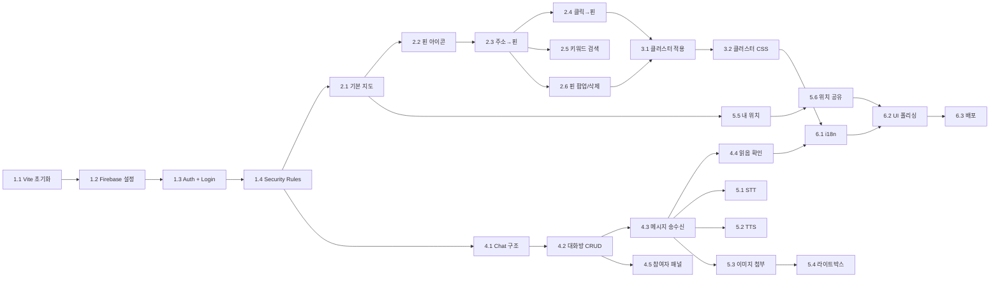

# ✅ Task Guide — GlobalMeet 클론 프로젝트 구현 순서

## 개요

이 문서는 GlobalMeet 프로젝트를 처음부터 구현하는 단계별 태스크 가이드입니다.
각 태스크는 **순서대로** 진행하며, 이전 태스크가 완료되어야 다음 태스크를 시작할 수 있습니다.

---

## M1: 프로젝트 초기화 + Firebase + Google 로그인

### Task 1.1: Vite + React 프로젝트 생성

- [ ] `npx -y create-vite@latest global-meet --template react`
- [ ] `cd global-meet && npm install`
- [ ] 필수 패키지 설치:
  ```bash
  npm install firebase react-router-dom@7 leaflet react-leaflet react-leaflet-cluster \
              leaflet.markercluster lucide-react date-fns i18next react-i18next \
              tailwindcss@3 postcss autoprefixer
  ```
- [ ] `npx tailwindcss init -p` — Tailwind 설정 초기화
- [ ] `tailwind.config.js`에 `content: ['./index.html', './src/**/*.{js,jsx}']` 설정
- [ ] `src/index.css`에 Tailwind 디렉티브 + 클러스터 CSS + pulse 애니메이션 추가
- **검증**: `npm run dev`로 기본 React 페이지 확인

### Task 1.2: Firebase 프로젝트 설정

- [ ] Firebase Console에서 새 프로젝트 생성 (또는 기존 프로젝트 사용)
- [ ] Authentication → Google 로그인 제공자 활성화
- [ ] Firestore Database 생성 (production mode)
- [ ] Storage 생성
- [ ] 웹 앱 등록 → config 값 복사
- [ ] `src/lib/firebase.js` 생성 — Firebase 초기화 코드
- **검증**: 콘솔에 Firebase 앱 초기화 성공 로그 확인

### Task 1.3: AuthContext + Login 페이지

- [ ] `src/context/AuthContext.jsx` 생성
  - `signInWithPopup(auth, GoogleAuthProvider)` 기반 `login()`
  - `signOut(auth)` 기반 `logout()`
  - `onAuthStateChanged`로 인증 상태 구독
  - 최초 로그인 시 `users/{uid}` Firestore 문서 생성
  - 재로그인 시 `lastSeen`만 업데이트
- [ ] `src/components/Login.jsx` 생성
  - Google 로그인 버튼 (Google 아이콘 SVG 포함)
  - 다크 테마 디자인
- [ ] `src/App.jsx` 설정
  - `AuthProvider` 래핑
  - `/login` → Login 컴포넌트
  - `/` → PrivateRoute → GlobalMeetingMap (빈 컴포넌트)
- **검증**: Google 로그인 → Firestore `users` 컬렉션에 문서 생성 확인

### Task 1.4: Firestore + Storage Security Rules 배포

- [ ] `firestore.rules` 파일 생성 (TRD 6장 참조)
- [ ] `storage.rules` 파일 생성 (TRD 7장 참조)
- [ ] `firebase deploy --only firestore:rules,storage` 또는 Console에서 직접 설정
- **검증**: 미인증 사용자가 Firestore 접근 시 권한 거부 확인

---

## M2: Leaflet 지도 + 핀 CRUD + Geocoding

### Task 2.1: 기본 지도 표시

- [ ] `src/components/GlobalMeetingMap.jsx` 생성
- [ ] `MapContainer` + `TileLayer` (OpenStreetMap) 렌더링
- [ ] 기본 중심: `[37.5665, 126.9780]`, 줌: `6`
- [ ] `MapResizeFix` 헬퍼 컴포넌트 — ResizeObserver로 `invalidateSize()`
- [ ] Leaflet CSS import (`leaflet/dist/leaflet.css`)
- [ ] 지도 높이: `60vh` (md: `70vh`), `min-height: 400px`
- **검증**: 페이지에 OpenStreetMap 지도가 정상 표시

### Task 2.2: 핀 아이콘 정의

- [ ] `savedPinIcon` (빨강 teardrop) — `L.divIcon` + SVG
- [ ] `pendingIcon` (오렌지 teardrop) — `L.divIcon` + SVG
- [ ] `myLocationIcon` (파란 pulse dot) — `L.divIcon` + CSS animation
- [ ] `sharedLocationIcon(name, isSelf)` (초록/빨강 dot + 이름 라벨)
- [ ] 기본 Leaflet 아이콘 URL 수정 (`L.Icon.Default.mergeOptions`)
- **검증**: 각 아이콘이 지도에 정상 렌더링

### Task 2.3: 주소 입력 → 핀 추가

- [ ] 주소 입력 폼 UI (주소 + 핀 제목 + 추가 버튼)
- [ ] `geocodeAddress(addr)` — Nominatim forward geocode API 호출
- [ ] 성공 시 Firestore `globalPins`에 `addDoc`
- [ ] 지도 `flyTo` 해당 위치로 이동
- [ ] `onSnapshot`으로 핀 목록 실시간 구독
- [ ] 저장된 핀들을 `savedPinIcon`으로 지도에 `Marker` 표시
- **검증**: 주소 입력 → 핀 추가 → 새로고침 없이 지도에 핀 표시

### Task 2.4: 지도 클릭 → 핀 추가

- [ ] `ClickToPin` 컴포넌트 — `useMapEvents({ click })` 핸들러
- [ ] 클릭 좌표로 `reverseGeocode(lat, lng)` 호출
- [ ] 오렌지 임시 핀 + 팝업 표시
- [ ] "이 위치에 핀을 추가할까요?" 확인 카드 UI
- [ ] 확인 시 `globalPins`에 저장, 취소 시 임시 핀 제거
- **검증**: 지도 클릭 → 오렌지 핀 → 주소 확인 → 확인 후 빨강 핀으로 전환

### Task 2.5: 키워드 검색

- [ ] 검색 도구 바 UI (토글 버튼 + 검색 입력 + 결과 리스트)
- [ ] `searchNominatim(query)` — Nominatim 키워드 검색 (limit=8)
- [ ] 결과 항목 클릭 → 해당 좌표로 임시 핀 생성
- **검증**: "남대문시장" 검색 → 결과 클릭 → 임시 핀 표시

### Task 2.6: 핀 팝업 + 삭제 + 핀 목록

- [ ] 핀 팝업: 제목, 주소, 등록자 표시
- [ ] 본인 핀에만 삭제 버튼 표시 → `deleteDoc` 호출
- [ ] 핀 수 표시 바 (클릭하면 핀 목록 모달)
- [ ] 핀 목록 모달: 전체 핀 리스트, 각 항목 클릭 시 `flyTo`
- **검증**: 핀 팝업에서 삭제 → 지도에서 즉시 제거

---

## M3: 마커 클러스터링

### Task 3.1: MarkerClusterGroup 적용

- [ ] `react-leaflet-cluster`에서 `MarkerClusterGroup` import
- [ ] 저장된 핀(`pins.map(...)`)을 `MarkerClusterGroup`으로 감싸기
- [ ] 설정: `chunkedLoading`, `maxClusterRadius={60}`, `spiderfyOnMaxZoom`, `zoomToBoundsOnClick`
- [ ] 임시 핀, 내 위치, 공유 위치는 클러스터 **밖**에 배치
- **검증**: 여러 핀 추가 후 줌아웃 → 숫자 뱃지 클러스터 표시

### Task 3.2: 클러스터 CSS 스타일링

- [ ] `index.css`에 `.marker-cluster-small`, `.marker-cluster-medium`, `.marker-cluster-large` 스타일 추가
- [ ] 소규모: 초록 (`rgba(110, 204, 57, 0.6)`)
- [ ] 중규모: 노란색 (`rgba(240, 194, 12, 0.6)`)
- [ ] 대규모: 오렌지 (`rgba(241, 128, 23, 0.6)`)
- [ ] `.marker-cluster div` — 중앙 원형 + 숫자 텍스트
- **검증**: 줌인/줌아웃 시 클러스터 색상 차등 표시, 부드러운 전환 애니메이션

---

## M4: 실시간 대화방

### Task 4.1: GlobalChat 기본 구조

- [ ] `src/components/GlobalChat.jsx` 생성
- [ ] 채팅 UI 레이아웃: 툴바 + 메시지 영역 + 입력 폼
- [ ] 높이: `32rem`, 배경: `gray-50`, 둥근 모서리 + 보더
- [ ] `GlobalMeetingMap.jsx` 하단에 `<GlobalChat />` 배치
- **검증**: 지도 아래에 빈 채팅 컨테이너 표시

### Task 4.2: 대화방 CRUD

- [ ] Firestore `globalChatRooms` 구독 (`where('members', 'array-contains', myEmail)`)
- [ ] 대화방 드롭다운 선택 UI
- [ ] `CreateRoomModal` 구현:
  - 대화방 이름 입력
  - 사용자 검색 (Firestore `users` 컬렉션 조회)
  - 멤버 선택 (태그 형태)
  - "만들기" → `globalChatRooms`에 `addDoc`
- [ ] 대화방 삭제 (방장만): 서브컬렉션 메시지 batch 삭제 → 대화방 문서 삭제
- [ ] 대화방 나가기 (비방장): `members`에서 자신 이메일 `arrayRemove`
- **검증**: 대화방 생성 → 드롭다운에 표시 → 삭제 시 목록에서 제거

### Task 4.3: 메시지 송수신

- [ ] 선택된 대화방의 `messages` 서브컬렉션 `onSnapshot` 구독
- [ ] 메시지 정렬: `timestamp` 오름차순
- [ ] 메시지 전송: `addDoc` (text, senderEmail, senderName, sourceLanguage, timestamp, readBy)
- [ ] 메시지 버블 UI:
  - 내 메시지: 오른쪽 정렬, 파란 배경
  - 상대 메시지: 왼쪽 정렬, 흰 배경
  - 발신자 이름 + 시간 표시
- [ ] 자동 스크롤: 새 메시지 → `scrollIntoView`
- [ ] 본인 메시지 삭제 버튼
- **검증**: 2개 브라우저로 동시 접속 → 실시간 메시지 송수신

### Task 4.4: 읽음 확인

- [ ] 메시지 수신 시 `readBy` 배열에 자신 이메일 `arrayUnion`
- [ ] 내 메시지의 읽음 상태 표시: ✓✓ (모두 읽음: 파란색, 일부: 회색)
- **검증**: 상대방이 대화방 진입 시 ✓✓ 파란색으로 변경

### Task 4.5: 참여자 패널

- [ ] 멤버 목록 패널 (토글 버튼)
- [ ] 방장 표시 (★), 본인 표시 ("나")
- [ ] 방장: "대화방 삭제" 버튼
- [ ] 비방장: "나가기" 버튼
- **검증**: 참여자 패널에서 멤버 목록 확인

---

## M5: 부가 기능

### Task 5.1: 음성 입력 (STT)

- [ ] `window.SpeechRecognition` 또는 `webkitSpeechRecognition` 사용
- [ ] 마이크 버튼 토글 (녹음 중: 빨간 pulse)
- [ ] `recognition.lang` = 사용자 선호 언어의 로케일 코드
- [ ] `recognition.onresult` → 실시간 입력란에 텍스트 반영
- [ ] 모바일에서 `continuous: false`
- **검증**: 마이크 클릭 → 음성 → 입력란에 텍스트 표시

### Task 5.2: 텍스트 음성 재생 (TTS)

- [ ] 각 메시지에 스피커 아이콘 버튼
- [ ] `SpeechSynthesisUtterance` 사용
- [ ] `utterance.lang` = 해당 메시지의 언어 로케일
- [ ] 재생 중 아이콘 pulse 효과
- [ ] 자동 재생 토글: 새 수신 메시지를 자동으로 TTS
- **검증**: 스피커 클릭 → 메시지 내용 음성 재생

### Task 5.3: 이미지 첨부

- [ ] `src/lib/imageUtils.js` — `compressImageToWebp()` 구현
- [ ] 파일 선택 (`<input type="file" accept="image/*">`)
- [ ] WebP 압축 (1280px, quality 0.82) → Firebase Storage 업로드
- [ ] 메시지에 `imageUrl`, `imagePath`, `imageWidth`, `imageHeight` 저장
- [ ] 채팅에서 이미지 썸네일 표시 (max-width: 220px)
- **검증**: 이미지 선택 → 업로드 → 채팅에 썸네일 표시

### Task 5.4: 이미지 라이트박스

- [ ] `src/components/ImageLightbox.jsx` 구현
- [ ] 이미지 클릭 → 전체화면 오버레이 (bg-black/85)
- [ ] 다운로드 버튼 (fetch → blob → download)
- [ ] ESC 키로 닫기
- **검증**: 이미지 클릭 → 전체화면 표시 → 다운로드 가능

### Task 5.5: 내 현재 위치

- [ ] 내 위치 버튼 (Crosshair 아이콘, 지도 우하단)
- [ ] `navigator.geolocation.getCurrentPosition()` 호출
- [ ] 파란 pulse dot으로 위치 표시
- [ ] 지도 `flyTo` 해당 위치
- **검증**: 위치 버튼 클릭 → 현재 위치에 파란 dot 표시

### Task 5.6: 실시간 위치 공유

- [ ] "내 위치 공유" 버튼
- [ ] `navigator.geolocation.watchPosition()` → 지속 추적
- [ ] Firestore `liveLocations/{uid}`에 실시간 업데이트 (`setDoc`)
- [ ] `onSnapshot`으로 다른 사용자 위치 구독
- [ ] 다른 사용자: 초록 dot + 이름 라벨, 본인: 빨강 dot
- [ ] 10분 이상 미갱신 사용자 필터링
- [ ] 공유 중인 사용자 목록 (접이식 패널, 지도 우상단)
- [ ] "공유 중지" → `clearWatch` + `deleteDoc`
- **검증**: 2개 기기에서 위치 공유 → 상대 위치가 지도에 실시간 표시

---

## M6: 다국어 + UI 폴리싱 + 배포

### Task 6.1: i18next 설정

- [ ] `src/i18n/index.js` — i18next 초기화 (`i18next-browser-languagedetector`)
- [ ] `src/i18n/locales/ko.json` — 한국어 번역
- [ ] `src/i18n/locales/en.json` — 영어 번역
- [ ] `src/i18n/locales/zh.json` — 중국어 번역
- [ ] 모든 하드코딩 문자열 → `t('key')` 치환
- **검증**: 브라우저 언어 변경 → UI 언어 전환

### Task 6.2: UI 폴리싱

- [ ] 로딩 상태: Loader 스피너 (지도, 핀, 채팅)
- [ ] 에러 상태: 알림 메시지
- [ ] 반응형 레이아웃: 모바일 지도 높이, 채팅 높이 조정
- [ ] 터치 최적화: 지도 터치 줌/드래그
- [ ] 전환 애니메이션: 클러스터, flyTo, 모달
- **검증**: 모바일 Chrome에서 전체 기능 정상 동작

### Task 6.3: 배포

- [ ] `npm run build` → `dist/` 생성
- [ ] Firebase Hosting 또는 Vercel로 배포
- [ ] 커스텀 도메인 연결 (선택)
- [ ] Firebase Auth 승인 도메인에 배포 도메인 추가
- **검증**: 배포 URL에서 Google 로그인 → 전체 기능 동작

---

## 의존성 다이어그램



---

## 진행 체크리스트

| 마일스톤 | 태스크 | 상태 |
|----------|--------|------|
| **M1** | 1.1 Vite 초기화 | ⬜ |
| | 1.2 Firebase 설정 | ⬜ |
| | 1.3 Auth + Login | ⬜ |
| | 1.4 Security Rules | ⬜ |
| **M2** | 2.1 기본 지도 | ⬜ |
| | 2.2 핀 아이콘 | ⬜ |
| | 2.3 주소→핀 | ⬜ |
| | 2.4 클릭→핀 | ⬜ |
| | 2.5 키워드 검색 | ⬜ |
| | 2.6 핀 팝업/삭제 | ⬜ |
| **M3** | 3.1 클러스터 적용 | ⬜ |
| | 3.2 클러스터 CSS | ⬜ |
| **M4** | 4.1 Chat 구조 | ⬜ |
| | 4.2 대화방 CRUD | ⬜ |
| | 4.3 메시지 송수신 | ⬜ |
| | 4.4 읽음 확인 | ⬜ |
| | 4.5 참여자 패널 | ⬜ |
| **M5** | 5.1 STT | ⬜ |
| | 5.2 TTS | ⬜ |
| | 5.3 이미지 첨부 | ⬜ |
| | 5.4 라이트박스 | ⬜ |
| | 5.5 내 위치 | ⬜ |
| | 5.6 위치 공유 | ⬜ |
| **M6** | 6.1 i18n | ⬜ |
| | 6.2 UI 폴리싱 | ⬜ |
| | 6.3 배포 | ⬜ |
